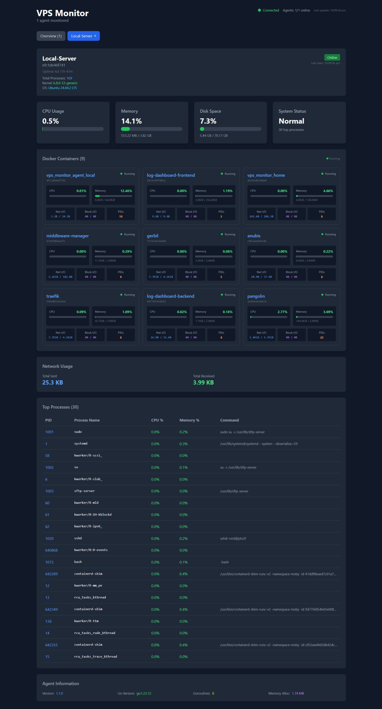

# VPS Monitor for pangolin users

A lightweight, real-time multi-agent server monitoring system with a modern web dashboard. Monitor CPU, memory, disk usage, processes, and Docker containers across multiple servers from a single interface.



##  Features

- **Real-time Monitoring**: Live system metrics with WebSocket updates
- **Multi-Agent Support**: Monitor multiple servers from one dashboard
- **Docker Integration**: Monitor Docker containers with detailed stats
- **Process Monitoring**: View top processes with CPU and memory usage
- **Modern UI**: Dark theme with responsive design and live updates
- **Lightweight**: Minimal resource usage (< 64MB RAM per agent)
- **Easy Deployment**: Single Docker Compose file deployment
- **Host System Access**: Full visibility into host processes and Docker containers

##  Monitored Metrics

### System Metrics
- CPU usage percentage
- Memory usage and availability
- Disk space utilization
- Network I/O statistics
- System uptime
- Kernel version and OS information

### Process Information
- Top processes by CPU usage
- Memory consumption per process
- Process command lines
- Total process count

### Docker Container Stats
- CPU usage per container
- Memory usage and limits
- Network and Block I/O
- Running process count (PIDs)
- Container status and health

##  Architecture

```
┌─────────────────┐    WebSocket/HTTP   ┌──────────────────┐
│   Web Browser   │ ◄─────────────────► │   Home Server    │
└─────────────────┘                     └──────────────────┘
                                                  ▲
                                                  │ HTTP API
                                         ┌────────┼────────┐
                                         │                 │
                                    ┌────▼───┐       ┌────▼───┐
                                    │ Agent1 │       │ Agent2 │
                                    └────────┘       └────────┘
```

- **Home Server**: Central dashboard and API server
- **Agents**: Lightweight monitoring agents deployed on target servers
- **Web Interface**: Modern React-based dashboard with real-time updates

##  Quick Start

### Using Pre-built Docker Images

Create a `docker-compose.yml` file:

```yaml

services:
  home-server:
    image: hhftechnology/vps-monitor-home:latest
    container_name: vps_monitor_home
    ports:
      - "8085:8085"
    environment:
      - GIN_MODE=release
    restart: unless-stopped
    deploy:
      resources:
        limits:
          cpus: '0.5'
          memory: 128M
        reservations:
          cpus: '0.1'
          memory: 32M

  agent:
    image: hhftechnology/vps-monitor-agent:latest
    container_name: vps_monitor_agent_local
    # Required for accessing host processes and Docker
    privileged: true
    volumes:
      # Docker socket for container stats
      - /var/run/docker.sock:/var/run/docker.sock:ro
      
      # Host filesystem for process information
      - /proc:/host/proc:ro
      - /sys:/host/sys:ro
      - /dev:/host/dev:ro
      - /etc/os-release:/host/etc/os-release:ro
      
      # Host root filesystem for disk usage
      - /:/host/root:ro
    user: "root" 
    environment:
      - HOME_SERVER_URL=http://home-server:8085
      - AGENT_NAME=Local-Server
      # Tell agent where to find host proc
      - HOST_PROC=/host/proc
      - HOST_SYS=/host/sys
      - HOST_ROOT=/host/root
    restart: unless-stopped
    deploy:
      resources:
        limits:
          cpus: '0.2'
          memory: 64M
        reservations:
          cpus: '0.05'
          memory: 16M
```

### Deploy the System

```bash
# Start the monitoring system
docker compose up -d

# View logs
docker compose logs -f

# Stop the system
docker compose down
```

### Access the Dashboard

Open your browser and navigate to: `http://your-server-ip:8085`

##  Configuration Options

### Home Server Environment Variables

| Variable | Default | Description |
|----------|---------|-------------|
| `GIN_MODE` | `debug` | Gin framework mode (`release` for production) |
| `PORT` | `8085` | Server listening port |

### Agent Environment Variables

| Variable | Default | Description |
|----------|---------|-------------|
| `HOME_SERVER_URL` | *Required* | URL of the home server (e.g., `http://192.168.1.100:8085`) |
| `AGENT_NAME` | hostname | Friendly name for the agent |
| `AGENT_ID` | hostname | Unique identifier for the agent |
| `HOST_PROC` | `/host/proc` | Path to host proc filesystem |
| `HOST_SYS` | `/host/sys` | Path to host sys filesystem |
| `HOST_ROOT` | `/host/root` | Path to host root filesystem |

##  Multi-Server Setup

To monitor multiple servers, deploy agents on each target server:

### Server 1 (Home Server + Local Agent)
```yaml
# Use the complete docker-compose.yml above
```

### Server 2 (Remote Agent Only)
```yaml

services:
  agent:
    image: hhftechnology/vps-monitor-agent:latest
    container_name: vps_monitor_agent_server2
    privileged: true
    volumes:
      - /var/run/docker.sock:/var/run/docker.sock:ro
      - /proc:/host/proc:ro
      - /sys:/host/sys:ro
      - /dev:/host/dev:ro
      - /etc/os-release:/host/etc/os-release:ro
      - /:/host/root:ro
    environment:
      - HOME_SERVER_URL=http://192.168.1.100:8085  # IP of home server
      - AGENT_NAME=Production-Server-2
      - HOST_PROC=/host/proc
      - HOST_SYS=/host/sys
      - HOST_ROOT=/host/root
    user: "root"   
    restart: unless-stopped
    deploy:
      resources:
        limits:
          cpus: '0.2'
          memory: 64M
```

### Server 3 (Another Remote Agent)
```yaml

services:
  agent:
    image: hhftechnology/vps-monitor-agent:latest
    container_name: vps_monitor_agent_server3
    privileged: true
    volumes:
      - /var/run/docker.sock:/var/run/docker.sock:ro
      - /proc:/host/proc:ro
      - /sys:/host/sys:ro
      - /dev:/host/dev:ro
      - /etc/os-release:/host/etc/os-release:ro
      - /:/host/root:ro
    environment:
      - HOME_SERVER_URL=http://192.168.1.100:8085  # IP of home server
      - AGENT_NAME=Database-Server
      - HOST_PROC=/host/proc
      - HOST_SYS=/host/sys
      - HOST_ROOT=/host/root
    restart: unless-stopped
    user: "root" 
    deploy:
      resources:
        limits:
          cpus: '0.2'
          memory: 64M
```

##  Security Considerations

### Required Permissions
- **Privileged Mode**: Required for host process visibility
- **Docker Socket**: Read-only access for container monitoring
- **Host Filesystem**: Read-only access to `/proc`, `/sys`, and `/dev`

### Network Security
- Home server exposes port 8085 - secure with firewall rules
- Agents communicate outbound to home server only
- No incoming ports required on agent servers

### Production Recommendations
```bash
# Use specific network for isolation
docker network create vps-monitor

# Limit agent resource usage
# (Already configured in compose files above)

# Use environment files for sensitive data
# Create .env file:
echo "HOME_SERVER_URL=http://your-home-server:8085" > .env
```

##  Dashboard Features

### Overview Page
- Multi-agent summary with online/offline status
- Aggregate statistics across all monitored servers
- Quick navigation between individual agents

### Individual Agent View
- Real-time system metrics with progress bars
- Docker container cards with detailed stats
- Process table with top CPU/memory consumers
- Network usage statistics
- Agent health information

### Real-time Updates
- WebSocket connection for live data
- Automatic reconnection on network issues
- Color-coded alerts for critical resources

##  Troubleshooting

### Agent Not Appearing in Dashboard

1. **Check agent logs**:
   ```bash
   docker logs vps_monitor_agent_local
   ```

2. **Verify connectivity**:
   ```bash
   # From agent server, test home server connectivity
   curl http://your-home-server:8085/api/health
   ```

3. **Check environment variables**:
   ```bash
   docker exec vps_monitor_agent_local env | grep HOME_SERVER_URL
   ```

### Permission Issues

If processes aren't showing:
```bash
# Ensure privileged mode is enabled
docker inspect vps_monitor_agent_local | grep Privileged

# Check volume mounts
docker inspect vps_monitor_agent_local | grep Mounts -A 20
```

### Docker Stats Not Working

```bash
# Verify Docker socket access
docker exec vps_monitor_agent_local docker ps

# Check socket permissions
ls -la /var/run/docker.sock
```

## Resource Usage

### Home Server
- **CPU**: ~0.1-0.5 cores
- **Memory**: ~32-128MB
- **Storage**: Minimal (no persistent data)

### Agent (per server)
- **CPU**: ~0.05-0.2 cores  
- **Memory**: ~16-64MB
- **Network**: ~1KB/s per agent

##  Development

### Building from Source

```bash
# Clone repository
git clone https://github.com/your-username/vps-monitor.git
cd vps-monitor

# Build home server
cd home
docker build -t vps-monitor-home:local .

# Build agent
cd ../agent
docker build -t vps-monitor-agent:local .

# Use local images in docker-compose.yml
# Change image names to use :local tag
```

### Local Development

```bash
# Start home server locally
cd home
go run main.go

# Start agent locally  
cd agent
HOME_SERVER_URL=http://localhost:8085 AGENT_NAME=dev-agent go run main.go
```

##  API Documentation

### Health Check
```
GET /api/health
```

### Agent List
```
GET /api/agents
```

### Individual Agent Data
```
GET /api/agents/:agentId
```

### WebSocket Connection
```
WS /api/ws
```

##  Contributing

1. Fork the repository
2. Create a feature branch
3. Make your changes
4. Add tests if applicable
5. Submit a pull request

##  License

This project is licensed under the MIT License - see the [LICENSE](LICENSE) file for details.

##  Acknowledgments

- Built with Go, React, and Docker
- Uses [gopsutil](https://github.com/shirou/gopsutil) for system metrics
- UI components built with [Tailwind CSS](https://tailwindcss.com/)

---

**Need help?** Open an issue on GitHub or check the troubleshooting section above.

**Want to contribute?** Pull requests are welcome! Please read the contributing guidelines first.